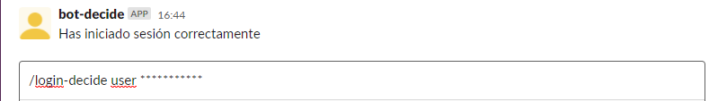

# bot-slack
https://github.com/EGC-decide-bailon/bot-slack
## Objetivo
Realizar un bot en slack capaz de realizar votaciones en decide usando `slash commands` en slack

## Slash commands
Comandos disponibles en slack
<table style="width: 100%; text-align: center;">
  <tr>
    <td style="width: 33%;">slash command</td>
    <td style="width: 33%;">Parámetros de entrada </td>
    <td style="width: 33%;">Funcionalidad</td>
  </tr>
  <tr>
    <td style="width: 33%;">/info-comandos </td>
    <td style="width: 33%;">... </td>
    <td style="width: 33%;">Muestra información sobre todos los comandos disponibles para la votación en decide</td>
  </tr>
  <tr>
    <td style="width: 33%;">/login-decide </td>
    <td style="width: 33%;">Usuario y contraseña </td>
    <td style="width: 33%;">Inicia sesión dentro de decide. En caso de error se notifica que no ha podido iniciar sesión</td>
  </tr>
  <tr>
    <td style="width: 33%;">/votaciones-disponibles</td>
    <td style="width: 33%;">... </td>
    <td style="width: 33%;">Muestra las votaciones disponibles en ese momento en decide. Es necesario haber iniciado sesión</td>
  </tr>
    <tr>
    <td style="width: 33%;">/detalles-votacion</td>
    <td style="width: 33%;">Id de la votación </td>
    <td style="width: 33%;">Muestra los detalles de la votación especificada</td>
  </tr>
    <tr>
    <td style="width: 33%;">/votar-decide</td>
    <td style="width: 33%;">Id de la votación y respuesta</td>
    <td style="width: 33%;">Te permite realizar la votación elegida con la respuesta que se ha especificado en decide </td>
  </tr>
</table>

## Como utilizarlos

### /info-comandos

Cuando se utiliza el comando, el bot reponderá por conversación privada al usuario que le mandó el comando

### /login-decide

Al usar el comando y pasarle los parámetros solicitados, responderá confirmando si se ha podido iniciar sesión o no

### /votaciones-disponibles

Muestra las votaciones disponibles en ese momento

### /detalles-votacion

Muestra los detalles de la votación seleccionada

### /votar-decide

Al usar el comando y ponerle los parámetros solicitados, responderá confirmando si se ha realizado correctamente la votación o no

